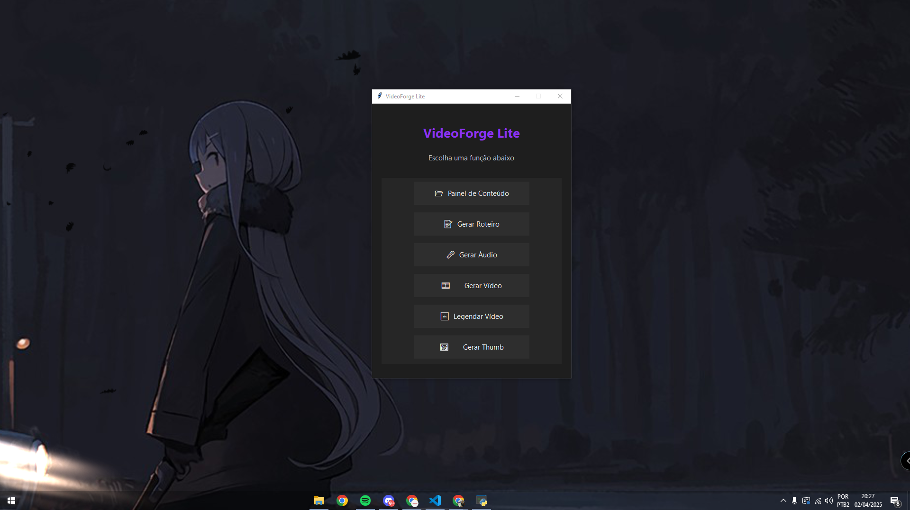
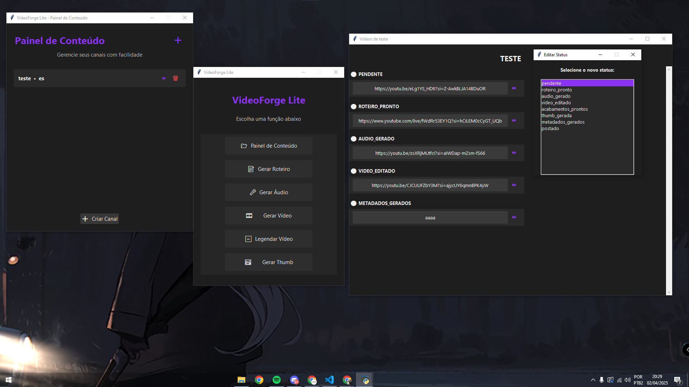

# 📼 VideoForge Lite

**VideoForge Lite** é uma reinterpretação minimalista, escrita inteiramente em **Python**, do projeto original [VideoForge](https://github.com/JacsonAnderson/VideoForge).  
Nesta versão, tecnologias como PHP, JavaScript, Docker, SQL, e até mesmo interfaces HTML/CSS foram **deliberadamente deixadas de lado**.  

O foco está em **agilidade no desenvolvimento** e na validação da lógica principal de automação de vídeos — priorizando funcionalidades, organização e controle em um ambiente simplificado e modular.

---

## 🚧 Status do Projeto

> Projeto em **desenvolvimento ativo**, com estrutura modular e expansão progressiva de recursos.

### ✅ Funcionalidades Concluídas
- [x] Interface para gerenciamento de canais
- [x] Cadastro de vídeos com controle de status individual
- [x] Edição manual de status com visualização agrupada por etapas
- [x] Tela de geração de roteiros (simulada, com logs e execução assíncrona)

### 🛠️ Em Desenvolvimento
- [x] Módulo inicial de roteiros em fase de integração
- [ ] Refinamento da interface de execução (UX + layout reativo)

### 🧠 Planejamento Imediato
- [ ] Extração de transcrição real via YouTube API
- [ ] Geração de tópicos a partir da transcrição
- [ ] Criação automatizada do roteiro com base nos tópicos extraídos

### 🎬 Etapas Futuras
- [ ] Edição automatizada de vídeos com GStreamer + ffmpeg
- [ ] Geração de legendas, thumbnails e metadados (finalização de conteúdo)

### 🗣️ Pós-MVP
- [ ] Geração de áudio por IA (Piper, ElevenLabs, etc.)

---

## 🧠 Lógica de Produção por Status

Cada vídeo cadastrado possui uma **tag de status** que define em qual etapa ele está no processo de produção automatizada:

| Etapa                  | Status (`tag`)             |
|------------------------|----------------------------|
| 📅 Link adicionado     | `pendente`                 |
| 🧠 Roteiro gerado      | `roteiro_pronto`           |
| 🎤 Áudio criado        | `audio_gerado`             |
| 🎞️ Edição feita        | `video_editado`            |
| 🛠️ Legendas aplicadas  | `acabamentos_prontos`      |
| 🖼️ Thumbnail gerada    | `thumb_gerada`             |
| 🧠 Metadados prontos   | `metadados_gerados`        |
| ✅ Publicado            | `postado`                  |

---

## 🔮 Versões Futuras

Este projeto funciona como um **laboratório experimental** para a versão oficial do [VideoForge](https://github.com/JacsonAnderson/VideoForge).  
Aqui, estou **testando e validando ideias**, implementando de forma rápida e modular os principais componentes que irão compor o sistema completo no futuro.

---

## 📌 Observações

Este repositório está sendo desenvolvido com **foco educacional e arquitetural**, com fins de estudo e experimentação.  
Ainda **não está pronto para produção real** — mas serve como base para aprendizado, testes e validação de fluxos criativos.

---

## 🙌 Como Contribuir

Sinta-se à vontade para:
- Abrir issues
- Sugerir melhorias
- Reportar bugs
- Enviar pull requests

---

## ⚙️ Requisitos

- Python `3.11.9+`
- Sistema: **Windows** (versão atual compatível apenas com Windows)

---

## 📸 Preview

### 🧠 Painel Principal

### 📂 Painel de Conteúdo (Canal, Vídeos e Status)

### 📝 Gerador de Roteiros

